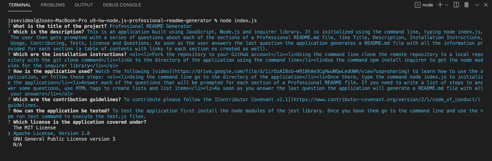
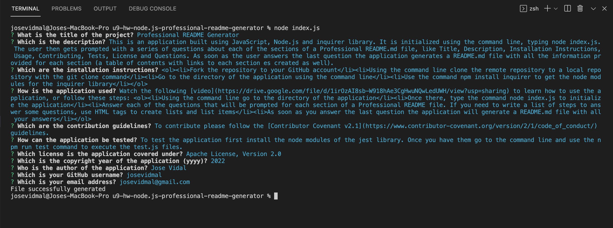
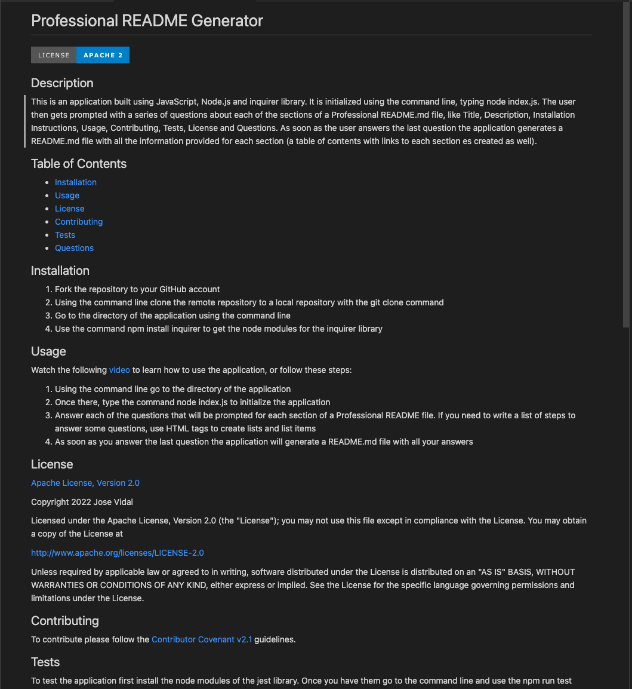

# u9-hw-node.js-professional-readme-generator
ITESM Coding Bootcamp - Unit 9 Homework - Node.js Professional README Generator

## Description

This was an on-the-job ticket activity where I was given an index.js, generateMarkdown.js and package.json files. Both JavaScript files had some code already in them, and my task was to add code to make all the functions work properly. This turned into a Node.js application that is initialized using the command line, going to the app directory and then typing `node index.js`. After this, the application starts prompting questions in the command line, requesting information for each section of a Professional README file. Those sections are Title, Description, Istallation, Usage, Contributing, Tests, License and Questions. As soon as the user answers the last questions and types enter the application writes a README.md file with all the information provided by the user, organized in the corresponding section. The README file also includes a Table of Contents with actual links to each section, and a badge below the Title with the License selected by the user. For the License section, the application takes into account if the user selects the N/A option from licenses list when the question is prompted. In that case the application generates a README file without a License section, license badge or license link in the Table of Contents. 

For this project first I created the repo, cloned it and then created a .gitignore file with the node_modules and .DS_Store as files to be ignored for future commits. Then, in the command line I used `npm init -y` to create a package.json. After that, I used `npm install inquirer` to get the necessary node modules to use the Inquirer package and be able to prompt questions in the command line. Then, I started working on the code, first using the `require()` method to include the necessary packages (inquirer, fs and generateMarkdown.js) in the index.js file. Next, I set an array of objects, where each object was one of the questions to be prompted. For almost all questions I used the input type, only for the license question I used the list type to prompt 4 license options (MIT, Apache 2, GPL version 3 and N/A). After this, for the function to write a file,  I used the fs module with `fs.writeFile` to instruct writing a file with a certain fileName, using the data from the generateMarkdown() function in the generateMarkdown.js module. If there is an error this function will show it in the command line, if not the function will display the message "File successfully generated". Then, for the `init()` function I set up a constant and assigned it an arrow function using `inquirer.prompt`. Next, I just called that function and used a promise to take the answers to each question and call the function to write the file with the arguments 'Sample-README.md' for the fileName parameter and answers for the data parameter. 

Now, for the generateMarkdown.js file, I basically used a set of if statements for each of the license functions. Based on the license chosen by the user, these functions would return the corresponding badge, link and notice. If the user doesn't want a license he could choose the N/A option. In this case the license functions would return an empty string. One thing I did for the license section function was using additional parameters for the year and author of the project. With this feature I was able to write the copyright line on the license notice. Finally, for the `generateMarkdown()` function I used template literals, to create a README template that would take the user answers placed in the right sections. For this last part I used an if and else statement to check if the license section was an empty string, thus generating a README template without license badge, link, section or even a license link in the Table of Contents. Otherwise, the function would return a README template with all the license information.

## Usage

The application looks like this when it is used:

Once the last question is answered the application will create a Sample-README.md file with a similar structure to this one (section contents will change depending on the answers to the prompted questions): 

To see the application in use watch the following [Walkthrough Video](https://drive.google.com/file/d/1irOzAI8sb-W918hAe3CgHwuNQwLedUWH/view?usp=sharing)

You can check this [Sample-README.md](./assets/Sample-README.md) file, which was generated using this application.  

## Technologies Used

* JavaScript
* Node.js
* NPM
* Markdown
* Inquirer.js
* File System (fs) module

## Contact Information

* GitHub Profile: [josevidmal](https://github.com/josevidmal)
* email: josevidmal@gmail.com

## License

[The MIT License](https://www.mit.edu/~amini/LICENSE.md)

Copyright 2022 Jose Vidal

Permission is hereby granted, free of charge, to any person obtaining a copy of this software and associated documentation files (the "Software"), to deal in the Software without restriction, including without limitation the rights to use, copy, modify, merge, publish, distribute, sublicense, and/or sell copies of the Software, and to permit persons to whom the Software is furnished to do so, subject to the following conditions:
    
The above copyright notice and this permission notice shall be included in all copies or substantial portions of the Software.
    
THE SOFTWARE IS PROVIDED "AS IS", WITHOUT WARRANTY OF ANY KIND, EXPRESS OR IMPLIED, INCLUDING BUT NOT LIMITED TO THE WARRANTIES OF MERCHANTABILITY, FITNESS FOR A PARTICULAR PURPOSE AND NONINFRINGEMENT. IN NO EVENT SHALL THE AUTHORS OR COPYRIGHT HOLDERS BE LIABLE FOR ANY CLAIM, DAMAGES OR OTHER LIABILITY, WHETHER IN AN ACTION OF CONTRACT, TORT OR OTHERWISE, ARISING FROM, OUT OF OR IN CONNECTION WITH THE SOFTWARE OR THE USE OR OTHER DEALINGS IN THE SOFTWARE.